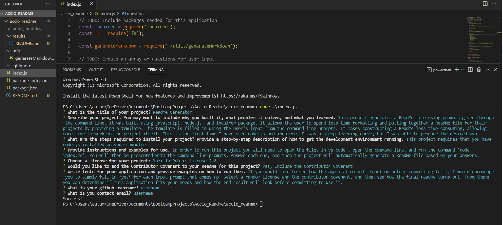

# Accio ReadMe - A ReadMe Generator

## Description

This project generates a ReadMe file using prompts given through the command line. It was built using javascript, node.js, and inquirer package. It allows the user to spend less time formatting and putting together a ReadMe file for their projects by providing a template. The template is filled in using the user's input from the command line prompts. It makes constructing a ReadMe less time consuming, allowing more time to work on the project itself. This is the first time I have used node.js and inquirer. It was a steep learning curve, but I was able to produce the desired mvp.

## Usage

In order to run this project you will need to open the files in vs code , open the command line, and run the command 'node index.js'. You will then be presented with the command line prompts. Answer each one, and then the project will automatically generate a ReadMe file based on your answers.

## Tests

If you would like to see how the application will function before committing to it, I would encourage you to simply fill in ‘yes’ for each input prompt that comes up. Select a random license and the contributor covenant, and then see how the final readme turns out. From there you can determine if this application fits your needs and how the end result will look before committing to use it.

## Video Demonstration

 

## Screenshot
 
This is a screenshot of the project.
 

 

## Credits
 
- Code for 'mailto:' link in md  
    - [w3schools](https://www.w3schools.io/file/markdown-links/)

- Code used as reference/starting point for if statement setup of license question and functions, const generateMarkdown, and functions writeToFile and init 
    - [markmcdnyu/README-Generator](https://github.com/markmcdnyu/README-Generator)

- License badges and links
    - [choosealicense.com](https://choosealicense.com/licenses/)